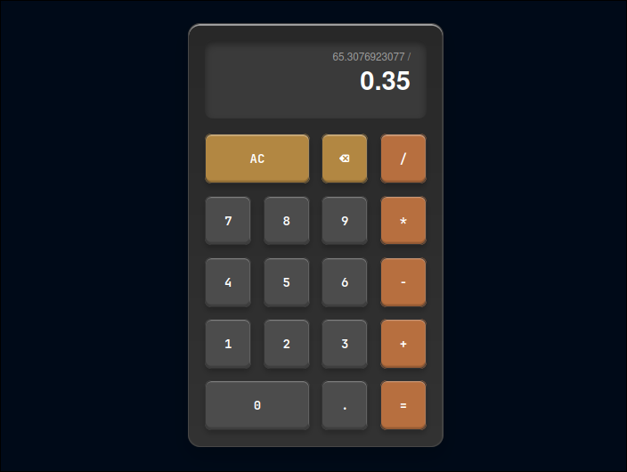
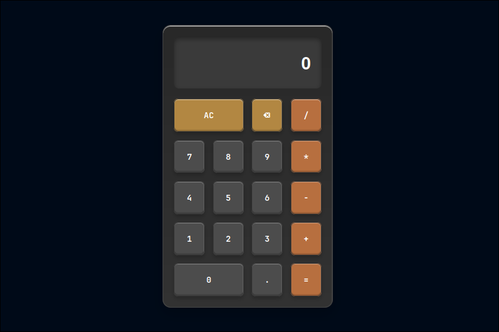
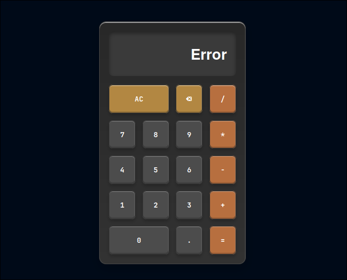

<div align="center">
    <h1 align="center">Web Calculator with Spring MVC</h1>
    <p align="center">
Functional web calculator using Spring MVC backend that exposes a REST API for calculations and a frontend built with vanilla HTML, CSS, and JavaScript.
    </p>
</div>

</br>

## 📸 Screenshots

Here's what the final calculator interface looks like:







</br>
</br>

## ✨ Features

- Basic Arithmetic Operations: Addition, subtraction, multiplication, and division.
- Chained Calculations: Perform sequential operations.
- Decimal Handling: Support for floating-point numbers.
- Reactive Interface: The display updates in real-time as the user interacts.
- Delete and Clear: Functions to delete the last digit and clear the current operation.
- Error Handling: Manages division-by-zero errors gracefully.

</br>
</br>

## 🛠️ Tech Stack

Backend:

- Java 21: Core programming language.
- Spring Boot 3: Framework for building the application and the REST API.
- Maven: Dependency management and project build tool.

Frontend:

- HTML5: Markup for the user interface.
- CSS3: Styling and responsive design.
- JavaScript: Client-side logic and API consumption.

</br>
</br>

## 🏛️ Architecture

This project is a monolithic application where both the frontend and backend are bundled and served by the same Spring Boot instance.

- Backend (Spring MVC): Manages all business logic through a RESTful API. It handles the mathematical calculations and serves the static frontend files.
- Frontend (Static Files): The user interface is built with vanilla web technologies and resides in the src/main/resources/static directory, allowing Spring Boot to serve it directly. While logically separate, the client is deployed as part of the same server package, simplifying the deployment process.

</br>
</br>

## 🚀 Getting Started

Follow these steps to run the project in your local environment.

Installation and Execution

```sh
Clone the repository:
git clone https://github.com/Andr3xDev/ARSW-Calculator.git
cd ARSW-Calculator
```

Build the project with Maven:

```sh
mvn clean install
```

Run the application:
```sh
mvn spring-boot:run
```

The application will be available at the following URL: http://localhost:8080

</br>
</br>

## 📝 API Endpoints

The calculator operates via a primary endpoint that handles all operations.

- POST /api/calculator/{operation}

Performs a mathematical operation. The request body must be a JSON object with the operands.
    
    URL Params:
        operation: The name of the operation.

    Body (Example for add):

```json
    {
      "operand1": 15,
      "operand2": 10
    }

```
    
Success Response (Code 200 OK):

```sh
    {
      "result": 25.0,
      "error": null
    }
```

Error Response (Code 400 Bad Request):

```json
    {
        "result": 0.0,
        "error": "Invalid operation: sum"
    }
```
